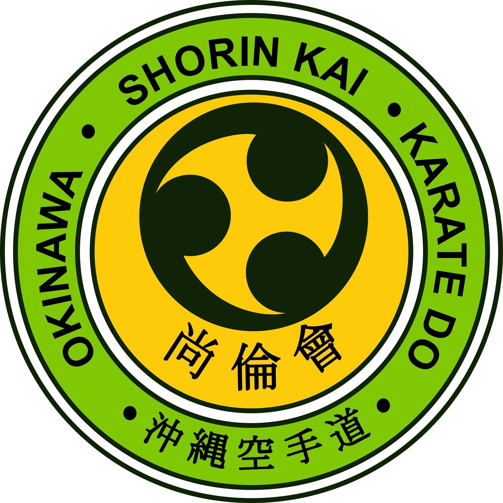

# Okinawa Shorin Kai Karate Do - Student Profile Portal

A modern, responsive web portal for inquiring about student profiles, achievements, and tournament history for **Okinawa Shorin Kai Karate Do**. This system provides a streamlined interface for parents, students, and administrators to access performance records.



## Features

- **Student Search**: Fast, fuzzy-search enabled directory to find students by name or unique ID (e.g., SK-0001).
- **Comprehensive Profiles**: Detailed views showcasing belt ranks, dojo affiliation, and participation history.
- **Tournament Records**: Track medals (Gold, Silver, Bronze) and event participation over time.
- **Responsive Design**: Optimized for both mobile devices and desktop screens.
- **Theme Support**: Includes a dark/light mode toggle for comfortable viewing in any environment.

## Tech Stack

- **Framework**: [Next.js](https://nextjs.org/) (React)
- **Styling**: [Tailwind CSS](https://tailwindcss.com/)
- **Database**: [Supabase](https://supabase.com/)
- **Search Engine**: [Fuse.js](https://fusejs.io/)

## Open Source

This is an open source project. We welcome the community to review the code and suggest improvements.

**Repository**: [https://github.com/ull0sm/animated-garbanzo.git](https://github.com/ull0sm/animated-garbanzo.git)

## Getting Started

1.  **Clone the repository**:
    ```bash
    git clone https://github.com/ull0sm/animated-garbanzo.git
    cd animated-garbanzo
    ```

2.  **Install dependencies**:
    ```bash
    npm install
    ```

3.  **Environment Setup**:
    Create a `.env.local` file in the root directory with your Supabase credentials:
    ```env
    NEXT_PUBLIC_SUPABASE_URL=your_supabase_url
    NEXT_PUBLIC_SUPABASE_ANON_KEY=your_supabase_anon_key
    ```
    *Note: Database schema is available in `schema.sql`.*

4.  **Run Development Server**:
    ```bash
    npm run dev
    ```
    Open [http://localhost:3000](http://localhost:3000) with your browser to see the result.

## Contact

For inquiries regarding the project or the karate school, please contact us:

📧 **Email**: [contact@shorinkai.in](mailto:contact@shorinkai.in)

---
&copy; 2026 Okinawa Shorin Kai Karate Do. All rights reserved.
